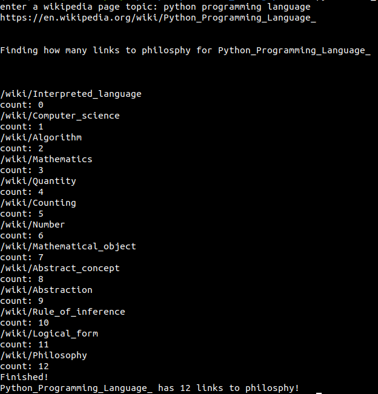
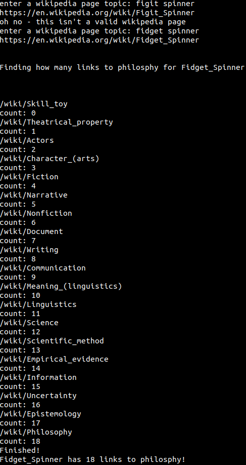
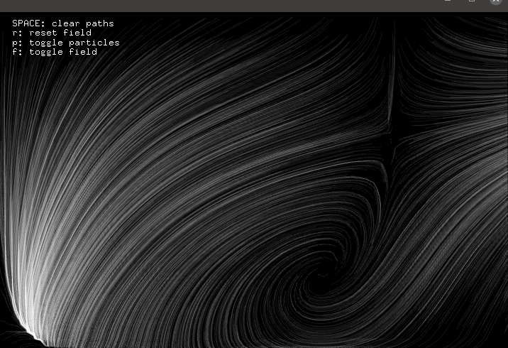
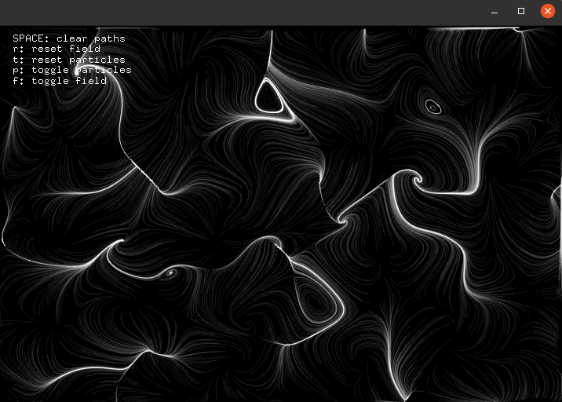
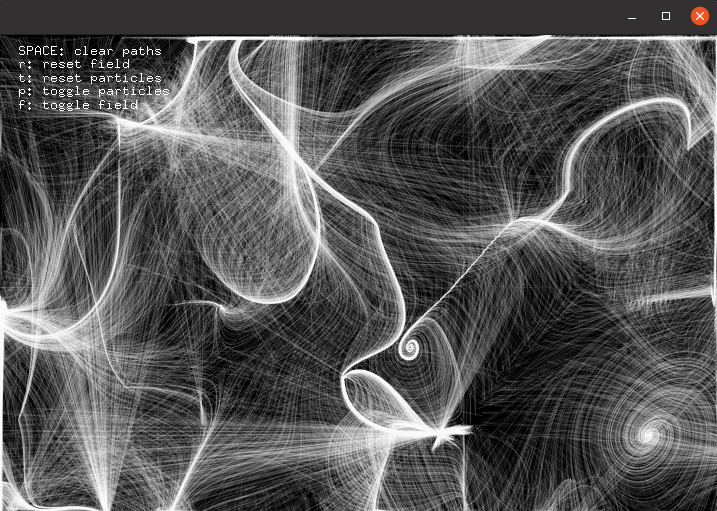

# Week 4

## EXERCISE
In class we were instructed to create a simple python web scraper using BeautifulSoup. I found out that by pressing the first non italicized non parenthized link on each wikipedia page you would get to wiki/Philosophy - or you would reach a cycle (repeated links) or dead end (no links). To showcase this I created a simple scraper that works out the "Philsophy number" of an inputted wiki page - that is the amount of links it takes to get to philosphy. The software includes support for cycles as well as dead ends. Below are some examples of the execution:
\

## HOMEWORK: Learning OpenFrameworks: Realtime Perlin Noise Vector Fields

I used the ofxVectorField add-on by Jeremy Rotsztain (which can be found [here](https://github.com/mantissa/ofxVectorField)).

#### Iteration 1
\
As you can see there were some unwanted straight line artefacts when the particles went off screen
\

#### Iteration 2
\
Removed this artefacts by not updating the paths when the particles left the screen.
\

#### Iteration 3
\
Added controls such that you could generate a new field, toggle rendering of particles (not seen in the images), and toggling rendering the vector field that the particles follow.
\

#### Iteration 4
\
Extended controls to allow for resetting the particles to their original positions. Added a lifetime to the particles.
\

#### Iteration 5
\
Adjusted the field generation.
\

