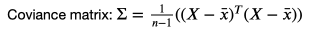
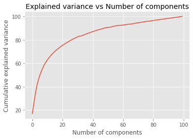
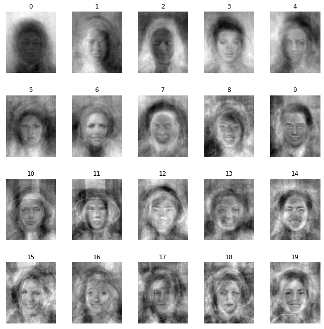
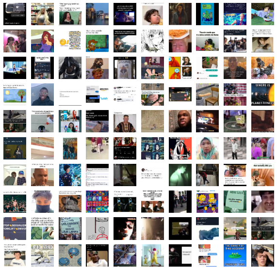
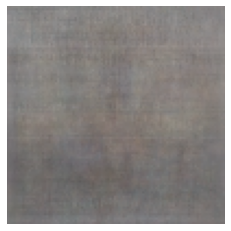
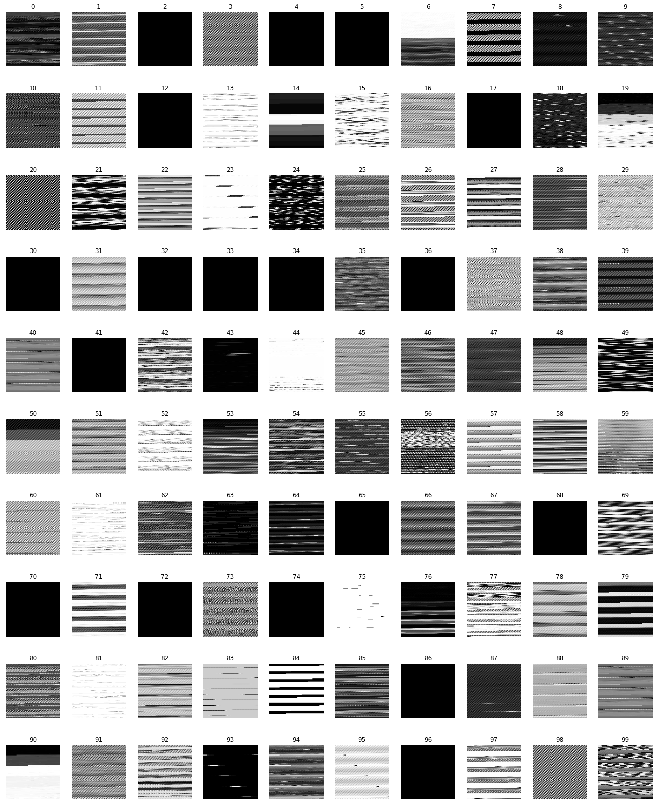
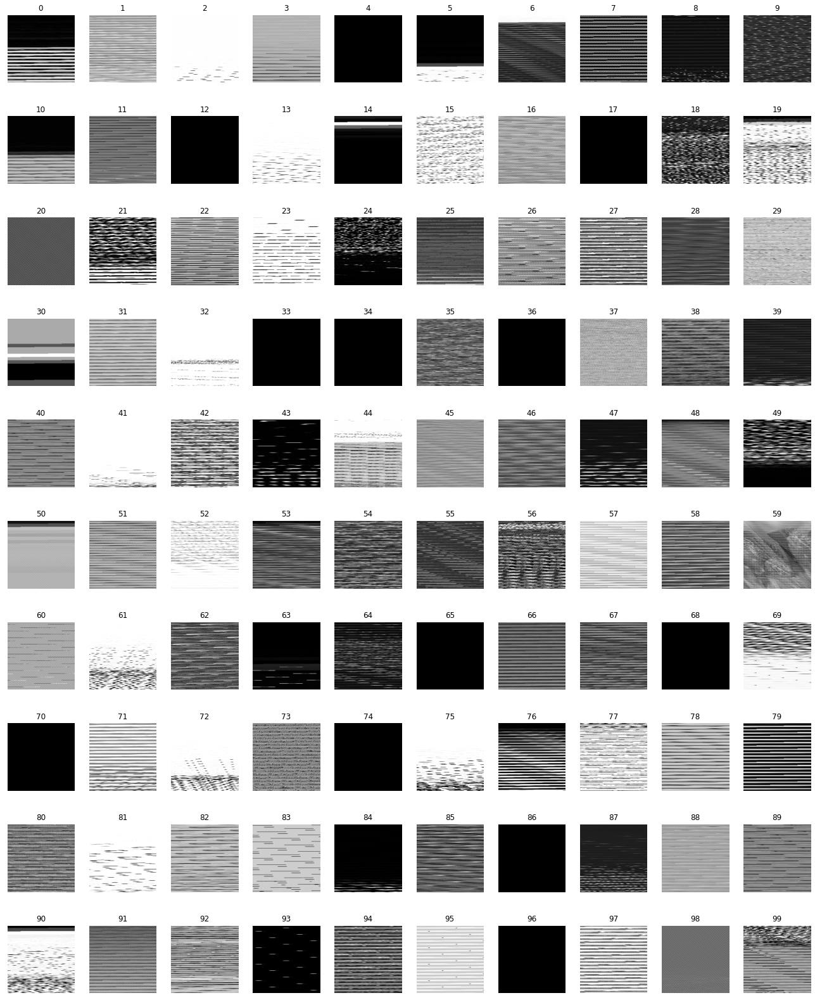

# Week 6 - Introduction to Machine Learning II
This week we looked more deeply into neural network concepts using jupyter notebooks. I was tasked to add a new transformation to the supplied dataset of faces.
## My implementation
I decided to investigate Principle Component Analysis. This is a dimensionaility reduction technique that allows data to be analysed much more efficiently. This is really useful for images since they contain width*height features which is far too many for most machine learning methods to work with. It finds an amount of principle components (= no data points supplies) and you can select the top X to fit your confidence level. To ensure I had a thorough understanding of this technique I applied it automatically using scikit-learn and manually using numpy. I also decided to convert the images to grayscale as this reduces information by a third.

### Automatic implentation using scikit-learn
This illustrates the top 12 (arbitrary) eigenfaces.
```
from sklearn.model_selection import train_test_split
from sklearn.datasets import fetch_lfw_people
from sklearn.metrics import classification_report
from sklearn.decomposition import PCA
from sklearn.neural_network import MLPClassifier


grayscale = np.zeros(data.shape[:-1])
h = grayscale.shape[2]
w = grayscale.shape[1]
for i in range(grayscale.shape[0]):
    grayscale[i] = rgb2gray(data[i])

# d = grayscale[1:].ravel()
d = grayscale.transpose(1,2,0).reshape(-1, grayscale.shape[0])
d = d.transpose(1,0)
# d = d.ravel()
n_components = 12
# print(d2.shape)
pca = PCA(n_components=n_components, whiten=True).fit(d)
eigenfaces = pca.components_.reshape((n_components, w, h))


# apply PCA transformation (to use if I were to train a network)
data_pca = pca.transform(d)

def plot_gallery(images, titles, h, w, n_row=3, n_col=4):
    """Helper function to plot a gallery of portraits"""
    plt.figure(figsize=(1.8 * n_col, 2.4 * n_row))
    plt.subplots_adjust(bottom=0, left=.01, right=.99, top=.90, hspace=.35)
    for i in range(n_row * n_col):
        plt.subplot(n_row, n_col, i + 1)
        plt.imshow(images[i].reshape((h, w)), cmap=plt.cm.gray)
        plt.title(titles[i], size=12)
        plt.xticks(())
        plt.yticks(())
plot_gallery(eigenfaces, range(n_components), w, h)

```

### Manual principle component analysis

```
standardised_data = np.zeros(grayscale.shape)
mean_img_gr = rgb2gray(mean_img)
std_img_gr = rgb2gray(std_img)
for i in range(grayscale.shape[0]):
    standardised_data[i] = (grayscale[i] - mean_img_gr) / std_img_gr
```
Firstly I standardise the data. After converting to grayscale, this involves subtracting the mean image and dividing by the standard deviation.
\

```
# formatting to 2D array
M = standardised_data.transpose(1,2,0).reshape(-1, standardised_data.shape[0])
covariance_matrix = np.cov(M.T)
```

Now I reshape the data such that I can find the covariance matrix as this requires a 2D matrix. The covariance matrix can be seen as a measure of how much each dimension varies from the mean compared to one another. That is, it contains information about the amount of variance shared between pairs of dimensions.
\
\

```
eigen_values, eigen_vectors = np.linalg.eig(covariance_matrix) #eigenfaces are the eigenvectors
```
The eigenvectors are the principle components, this makes sense as eigen vectors are orthogonal to each another so provide the basis for the data points. Thankfully I didn't have to revisit any computational linear algebra from university and I could find the eigendecomposition of the covariance matrix using numpy's `linalg`.  
```
# To work out the PCA transformation matrix

# Calculating the explained variance on each of components
variance_explained = []
for i in eigen_values:
     variance_explained.append((i/sum(eigen_values))*100)

# print(variance_explained)
# 18.7% of variance i ndata is explained by first principle component
# Identifying components that explain at least 80%
cumulative_variance_explained = np.cumsum(variance_explained)
# This tells me I need the first 10 components for 80% confidence level

plt.plot(range(cumulative_variance_explained.shape[0]), cumulative_variance_explained)
plt.xlabel("Number of components")
plt.ylabel("Cumulative explained variance")
plt.title("Explained variance vs Number of components")
plt.show()

# The components whose eigenvalue falls above the point where the slope of the
# line changes most drastically is called the "elbow"

```
Here I am trying to find the optimal amount of principle components to be used for analysis. Due to the small dataset, I opted for a 80% confidence level which came to about 20 components
\

```
# PCA transformation matrix using first 20 principle components
projection_matrix = (eigen_vectors.T[:][:20]).T
data_pca2 = M.dot(projection_matrix)


eigenfaces2 = data_pca2.T.reshape((20, w, h))
for i in range(20):
    eigenfaces2[i] = (eigenfaces2[i]  * std_img_gr) + mean_img_gr

plot_gallery(eigenfaces2, range(20), w, h, 4, 5)
```

\

## Task 2: Aquiring a new dataset
For this exercise I decided to build a dataset of dank memes. I decided to scrape instagram with the hastag #dankmeme
```
from bs4 import BeautifulSoup
import urllib.request
from urllib.error import HTTPError
from urllib.parse import urljoin
import selenium.webdriver as webdriver
import time

url = 'https://www.instagram.com/explore/tags/dankestmemes/'
driver = webdriver.Firefox(executable_path='geckodriver')
driver.get(url)

soup = BeautifulSoup(driver.page_source)
```
Do you to the infinity scrolling I had to manually inject some javascript periodically.
```

time.sleep(2)  # Allow 2 seconds for the web page to open
scroll_pause_time = 1 # You can set your own pause time. My laptop is a bit slow so I use 1 sec
screen_height = driver.execute_script("return window.screen.height;")   # get the screen height of the web
i = 1

while i < 25:
    # scroll one screen height each time
    driver.execute_script("window.scrollTo(0, {screen_height}*{i});".format(screen_height=screen_height, i=i))  
    i += 1
    time.sleep(scroll_pause_time)
    # update scroll height each time after scrolled, as the scroll height can change after we scrolled the page
    scroll_height = driver.execute_script("return document.body.scrollHeight;")  
    # Break the loop when the height we need to scroll to is larger than the total scroll height
    if (screen_height) * i > scroll_height:
        break
# driver.switch_to.default_content()
tags=soup.findAll('img',{"src":True})
test = [tag['src'] for tag in tags]
print(test[0])
print(len(test))
```
Since you could only scrape around 33 images before being met with a log in screen, I changed the hashtag subtly and incrememnted an index for saving the files.
```
index = 67 # incremment by 33 each time

for n, img in enumerate(test):
    if(img[0] == '/'): continue
    urllib.request.urlretrieve(img, "dank_memes/" + str(n+index))
```

\
\
Finding the average dank meme
```
import glob
import cv2

def load_images_from_folder(folder):
    images = []
    for filename in os.listdir(folder):
        img = cv2.imread(os.path.join(folder,filename))
        if img is not None:
            res = cv2.resize(img, dsize=(100, 100), interpolation=cv2.INTER_CUBIC)
            res = cv2.cvtColor(res, cv2.COLOR_BGR2RGB)
            images.append(res)
    return images

meme_list = load_images_from_folder('dank_memes/')
memes = np.array(meme_list)
print(memes.shape)
print('meme shape:', np.array(memes).shape)
plt.figure(figsize=(10,10)) # specifying the overall grid size

for i in range(100):
    plt.subplot(10,10,i+1)    # the number of images in the grid is 5*5 (25)
    plt.imshow(memes[i])
    plt.axis('off')
plt.show()  
```

\
\
The average meme looks like a messy blank canvas. This was to be expected as the dataset was so small (100) and varied. I think it would be really cool to do a project surrounding this, possibly making an AI meme account with pictures and captions acquired through popular posts - filtered or generated using sophisticated ML techniques - and seeing if it can get a decent following without telling anyone that it is a bot.
\
\
During the task, there were some happy accidents when displaying the dataset. I thought they looked really cool and would be interested in doing a piece of these glitchy images.


\
\
\

