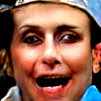

# Week 7 - Style transfer and Generative Adversarial Networks
This week we were introduced to style transfer and generative adversarial networks. Whilst I have covered both in detail before, this was useful learning exercise for me to understand tensorflow - as most of my ML experience has been using the pytorch library.

## Style transfer
Using a pretrained model via `tensforflow_hub` I was able to transfer the style from one image to the content of another. This can be seen below.

\
\
I additionally opted to carry out some experiments on the preprocessing of the style image. The default involved (after resizing to 256x256) applying average pooling with kernel size 3 and stride 1 (both directions). Average pooling is a technique used to downsample an image into a smoother format. The kernel size affects how averaged the image will be and the stride affects how many pixels the kernel moves along in the image (ie the size of output); a kernel and stride size of 1 will return the same image.
#### Default (k=3, s = 1)

#### k=1, s = 1

#### k=5, s = 1

#### k=3, s = 2

#### k=3, s = 3

\
\
\
As the kernel size increases, the output image ends up looking more blurry on it's edges but the content remains visible. A kernel size of 1 (no averaging - just striding) gives a crackly effect like it is on a piece of parchment. In other words, the lower level features have become more prominent. Increasing the stride has a weird affect on the colour of the ouput image, especially from a stride of 2 to 3. I believe this is probably because the pretrained model doesn't expect to get images this small as input.
\
\
\
I was curious as to why average pool was used instead of max pool, as this is much better at extracting edges and other lower level features. I decided to see what this would look like with the default configurations.
#### Max pooling

\
\
Interesting... This result clearly illustrated that there was a sacrifice of the content in favour of the style, but the output still looked cool.

## GAN's (briefly)
The next stage of the set work required me to look at Generative Adversarial Networks. I completed the notebook exercise and below are some pictures of this process.
\

#### Horror creation 1

#### Horror creation 2

\
\
\
I found it both fun and unnerving to watch the network try and find the closest faces latent space to a target image.

#### Start Image 1 (from dataset)

#### Target Image 1 (from dataset)

#### Progression 1

#### Final Target 1

\
\
I decided to try it on my own face. First with 200 iterations, then 1000 and then 1000 with a different starting vector.

#### Start Image 2 (from dataset)

#### Target image 2 (me)

#### Progression 2 (200 iterations)

#### Final Target 2 (200 iterations)

#### Progression 2 (1000 iterations)

#### Final Target 2 (1000 iterations)

#### Progression 3 (1000 iterations)

#### Final Target 3 (1000 iterations)

\
\
\
Clearly my face does not fit the data that the network was trained on well. I think my webcam and the lighting in my room makes the colours of the image too muted. I also noticed that 1000 iterations didn't make that much of a difference as the loss tended to plateu after 250 iterations. This can be seen for the two graphs of 100 iterations below.
\
\

\

## Brief introduction to tensorflow
Following the other notebok in the repo, I was able to train and design a neural network in Tensorflow to fit a regression of a custom trigonetric function.

#### A simple y= mx + b fit

#### Fitting to a polynomial (order 4)

#### Fitting to a polynomial (order 5)

#### Adding non-linear layers (tanh activations)

### Image inpainting
Having learned of image inpainting, I applied the technique to an image of my face. A gif of many, many iterations can be seen below.

