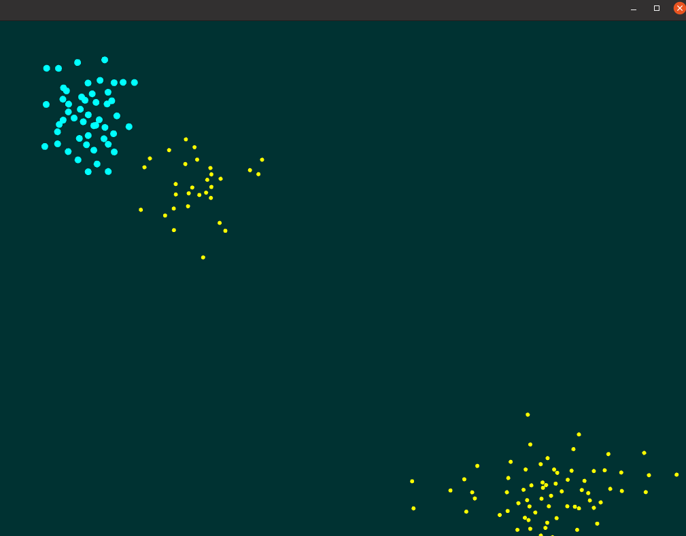

# Week 9: C++ principles
This week we looked at how polymorphism and inheritance works in C++. I built on the given Boids example with an extra `Boid_Two` class which inherits the `Boid` class. The code features functionaility to create more than one flock dynamically (you don't even need an extra class). I also added a max velocity variable so the particles didn't move so erratically. A screenshot can be seen below.
\
\

